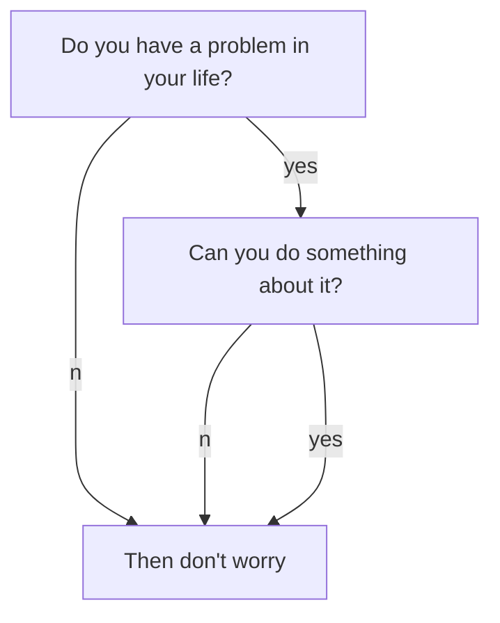
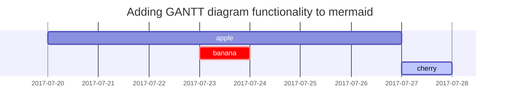
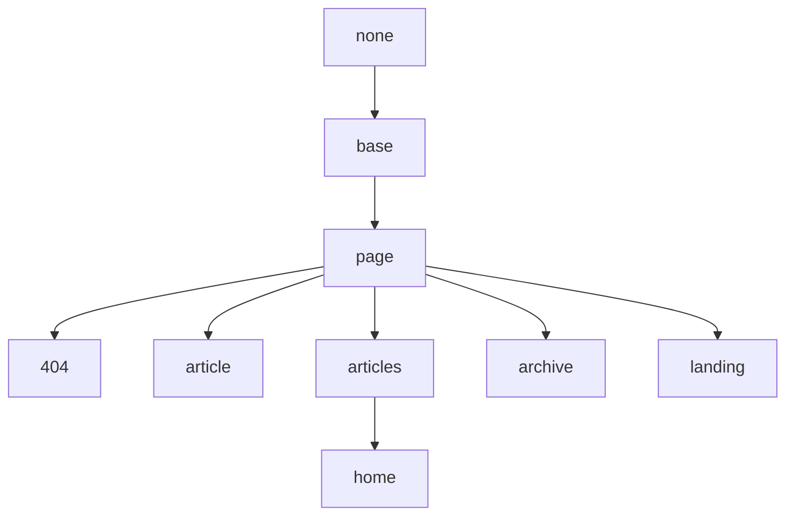

# Jekyll博客的编写

在[目录结构](http://jekyllcn.com/docs/structure/)介绍中说明过，**所有的文章都在 */_posts* 文件夹中**。这些文件可以用 Markdown 或 HTML 编写。只要文件中有 YAML 头信息，它们就会从源格式转化成 HTML 页面，从而成为你的静态网站的一部分。

<!--more-->

## 创建文章

发表一篇新文章，你所需要做的就是在 */_posts* 文件夹中创建一个新的文件。文件名的命名非常重要。Jekyll 要求一篇文章的文件名遵循下面的格式：

    年-月-日-标题.MARKUP

下面是一些合法的文件名的例子：

    2011-12-31-new-years-eve-is-awesome.md
    2012-09-12-how-to-write-a-blog.markdown

## 内容相关

所有博客文章顶部必须有一段 YAML 头信息(YAML front-matter)。

为了提高文章的阅读和书写体验，TeXt 在 Markdown 原有的基础上做了一些增强。

### YAML 头信息
```yaml
    ---
    layout: article
    title: Document - Writing Posts
    mathjax: true
    ---
```
{ 
在 `---` 之间你可以设置属性的值，可以把它们看作页面的配置，这些配置会覆盖在 *_config.yml* 文件中设置的全局配置。

除去 Jekyll 自定义的变量外，TeXt 也定义了一些额外的变量，详情请戳[布局](https://tianqi.name/jekyll-TeXt-theme/docs/zh/layouts)。

# Markdown增强

你需要在 *_config.yml* 或 YAML 头信息中设置相关的属性为 `true` 来开启对应的功能。

| 增强项 | 描述 |
| --------------- | ----------- |
| **Mathjax** | 在文章中方便的加入数学公式，使用 MathML、LaTeX 和 ASCIIMathML 语法 | [示例](https://tianqi.name/jekyll-TeXt-theme/post/2017/07/07/mathjax.html) |
| **Mermaid** | 在文章中方便的加入流程图 | [示例](https://tianqi.name/jekyll-TeXt-theme/post/2017/06/06/mermaid.html) |
| **Chart**   | 在文章中方便的加入可交互的图表 | [示例](https://tianqi.name/jekyll-TeXt-theme/post/2017/05/05/chart.html) |

## Mathjax

When $$a \ne 0$$, there are two solutions to $$ax^2 + bx + c = 0$$ and they are

$$x_1 = {-b + \sqrt{b^2-4ac} \over 2a}$$

$$x_2 = {-b - \sqrt{b^2-4ac} \over 2a} \notag$$

**markdown:**

```tex
When $$a \ne 0$$, there are two solutions to $$ax^2 + bx + c = 0$$ and they are
$$x_1 = {-b + \sqrt{b^2-4ac} \over 2a}$$
$$x_2 = {-b - \sqrt{b^2-4ac} \over 2a} \notag$$
```

**当 MathJax 激活后**，你可以设置 `mathjax_autoNumber: true` 让公式自动编号，你可以使用 \notag 或者 \nonumber 阻止某条公式自动编号。
{:.info}

## Mermaid



**markdown:**

    ```mermaid
    graph TB;
        A[Do you have a problem in your life?]
        B[Then don't worry]
        C[Can you do something about it?]
        A--no-->B;
        A--yes-->C;
        C--no-->B;
        C--yes-->B;
    ```

[Mermaid](https://mermaidjs.github.io/) 支持以下三种示意图:

- [Flowchart](https://mermaidjs.github.io/flowchart.html)

- [Sequence Diagram](https://mermaidjs.github.io/sequenceDiagram.html)

- [Gant Diagram](https://mermaidjs.github.io/gantt.html)

## Chart

```chart
{
  "type": "line",
  "data": {
    "labels": [
      "January",
      "February",
      "March",
      "April",
      "May",
      "June",
      "July"
    ],
    "datasets": [
      {
        "label": "# of bugs",
        "fill": false,
        "lineTension": 0.1,
        "backgroundColor": "rgba(75,192,192,0.4)",
        "borderColor": "rgba(75,192,192,1)",
        "borderCapStyle": "butt",
        "borderDash": [],
        "borderDashOffset": 0,
        "borderJoinStyle": "miter",
        "pointBorderColor": "rgba(75,192,192,1)",
        "pointBackgroundColor": "#fff",
        "pointBorderWidth": 1,
        "pointHoverRadius": 5,
        "pointHoverBackgroundColor": "rgba(75,192,192,1)",
        "pointHoverBorderColor": "rgba(220,220,220,1)",
        "pointHoverBorderWidth": 2,
        "pointRadius": 1,
        "pointHitRadius": 10,
        "data": [
          65,
          59,
          80,
          81,
          56,
          55,
          40
        ],
        "spanGaps": false
      }
    ]
  },
  "options": {}
}
```

**markdown:**

    ```chart
    {
      "type": "polarArea",
      "data": {
        "datasets": [
          {
            "data": [
              11,
              16,
              7,
              3,
              14
            ],
            "backgroundColor": [
              "#FF6384",
              "#4BC0C0",
              "#FFCE56",
              "#E7E9ED",
              "#36A2EB"
            ],
            "label": "My dataset"
          }
        ],
        "labels": [
          "Red",
          "Green",
          "Yellow",
          "Grey",
          "Blue"
        ]
      },
      "options": {}
    }
    ```

[Chart.js](http://www.chartjs.org/docs/latest/) 支持以下 7 种图表:

- [Line Chart](http://www.chartjs.org/docs/latest/charts/line.html)

- [Bar Chart](http://www.chartjs.org/docs/latest/charts/bar.html)

- [Radar Chart](http://www.chartjs.org/docs/latest/charts/radar.html)

- [Polar Area Chart](http://www.chartjs.org/latest/charts/polar.html)

- [Pie Chart](http://www.chartjs.org/docs/latest/charts/doughnut.html)

- [Doughnut Chart](http://www.chartjs.org/docs/latest/charts/doughnut.html)

- [Bubble Chart](http://www.chartjs.org/docs/latest/charts/bubble.html)

# Markdown文本样式

为了展示Markdown语法的渲染，[**Chirpy**](https://github.com/cotes2020/jekyll-theme-chirpy/fork), 你也可以用它作为写作的例子。 现在，让我们来看看文本和版式。  

## 标题

<h1 data-toc-skip> H1 - 开头</h1>

<h2 data-toc-skip>H2 - heading</h2>

<h3 data-toc-skip>H3 - heading</h3>

<h4>H4 - heading</h4>
**markdown:**
```markdown
# H1 - 开头

## H2 - heading

### H3 - heading

#### H4 - heading
```
<br>

## 文章段落

I wandered lonely as a cloud

That floats on high o'er vales and hills,

When all at once I saw a crowd,

A host, of golden daffodils;

Beside the lake, beneath the trees,

Fluttering and dancing in the breeze.


## 列表

### 有序列表

1. Firstly
2. Secondly
3. Thirdly

**markdown:**
```markdown
1. Firstly
2. Secondly
3. Thirdly
```
### 无序列表

- 章节
  - 节选
    - 段落

**markdown:**
```markdown
- 章节
  - 节选
    - 段落
```

### 任务列表

- [ ] TODO
- [x] Completed
- [ ] Defeat COVID-19
  - [x] Vaccine production
  - [ ] Economic recovery
  - [ ] People smile again

**markdown:**
```markdown
- [ ] TODO
- [x] Completed
- [ ] Defeat COVID-19
  - [x] Vaccine production
  - [ ] Economic recovery
  - [ ] People smile again
```

### 描述列表

Sun
: the star around which the earth orbits

Moon
: the natural satellite of the earth, visible by reflected light from the sun

**markdown:**
```markdown
Sun
: the star around which the earth orbits

Moon
: the natural satellite of the earth, visible by reflected light from the sun
```
## 引用

> This line shows the _block quote_.

**markdown:**

```markdown
> This line shows the _block quote_.
```

## 表格	

| Company                      | Contact          | Country |
|:-----------------------------|:-----------------|--------:|
| Alfreds Futterkiste          | Maria Anders     | Germany |
| Island Trading               | Helen Bennett    | UK      |
| Magazzini Alimentari Riuniti | Giovanni Rovelli | Italy   |

**markdown:**
```markdown
| Company                      | Contact          | Country |
|:-----------------------------|:-----------------|--------:|
| Alfreds Futterkiste          | Maria Anders     | Germany |
| Island Trading               | Helen Bennett    | UK      |
| Magazzini Alimentari Riuniti | Giovanni Rovelli | Italy   |
```

## 链接

<http://127.0.0.1:4000>

**markdown:**
```markdown
<http://127.0.0.1:4000>
```

## 脚注

点击右上边的脚注[^footnote], 这里是另一个脚注[^fn-nth-2].

**markdown:**
```markdown
点击右上边的脚注[^footnote], 这里是另一个脚注[^fn-nth-2].
```

### 脚注注释

[^footnote]: The footnote source
[^fn-nth-2]: The 2nd footnote source

**markdown:**
```markdown
[^footnote]: The footnote source
[^fn-nth-2]: The 2nd footnote source
```
## 提示

| 样式名称 |
| ---- |
| **success** |
| **info** |
| **warning** |
| **error** |

Success Text.
{:.success}

Info Text.
{:.info}

Warning Text.
{:.warning}

Error Text.
{:.error}

**markdown:**

    Success Text.
    {:.success}
^
    Info Text.
    {:.info}
^
    Warning Text.
    {:.warning}
^
    Error Text.
    {:.error}

## 标签

| Class Names |
| ---- |
| **success** |
| **info** |
| **warning** |
| **error** |

`success`{:.success}

`info`{:.info}

`warning`{:.warning}

`error`{:.error}

**markdown:**

    `success`{:.success}
^
    `info`{:.info}
^
    `warning`{:.warning}
^
    `error`{:.error}


## 图像

| 样式名称 |
| ---- |
| **border** |
| **shadow** |
| **rounded** |
| **circle** |

### Border

<div class="grid-containre">
<div class="grid grid--p-2">
<div class="cell cell--12 cell--md-4 " markdown="1">
{:.border}
</div>
<div class="cell cell--12 cell--md-auto" markdown="1">
    {:.border}
</div>
</div>
</div>

### Shadow

<div class="grid-containre">
<div class="grid grid--p-2">
<div class="cell cell--12 cell--md-4 " markdown="1">
{:.shadow}
</div>
<div class="cell cell--12 cell--md-auto" markdown="1">
    {:.shadow}
</div>
</div>
</div>

### Rounded

<div class="grid-containre">
<div class="grid grid--p-2">
<div class="cell cell--12 cell--md-4 " markdown="1">
{:.rounded}
</div>
<div class="cell cell--12 cell--md-auto" markdown="1">
    {:.rounded}
</div>
</div>
</div>

### Circle

<div class="grid-containre">
<div class="grid grid--p-2">
<div class="cell cell--12 cell--md-4 " markdown="1">
{:.circle}
</div>
<div class="cell cell--12 cell--md-auto" markdown="1">
    {:.circle}
</div>
</div>
</div>

### Mixture

<div class="grid-containre">
<div class="grid grid--p-2">
<div class="cell cell--12 cell--md-4 " markdown="1">
{:.border.rounded}
</div>
<div class="cell cell--12 cell--md-auto" markdown="1">
    {:.border.rounded}
</div>
</div>
</div>

<div class="grid-containre">
<div class="grid grid--p-2">
<div class="cell cell--12 cell--md-4 " markdown="1">
{:.circle.shadow}
</div>
<div class="cell cell--12 cell--md-auto" markdown="1">
    {:.circle.shadow}
</div>
</div>
</div>

<div class="grid-containre">
<div class="grid grid--p-2">
<div class="cell cell--12 cell--md-4 " markdown="1">
{:.circle.border.shadow}
</div>
<div class="cell cell--12 cell--md-auto" markdown="1">
    {:.circle.border.shadow}
</div>
</div>
</div>

- 默认 (带说明文字)

{: width="20%" height="20%"}
_Full screen width and center alignment_

<br>

- 阴影

{: .shadow width="20%" height="20%" style="max-width: 90%" }
_shadow effect (visible in light mode)_

<br>

- 左对齐

{: width="20%" height="20%" style="max-width: 70%" .normal}

<br>

- 向左浮动

  {: width="20%" height="20%" style="max-width: 200px" .left}
  "一个重复和无意义的文本被用来填补空白。 一个重复和无意义的文本被用来填补空白。 一个重复和无意义的文本被用来填补空白。 一个重复和无意义的文本被用来填补空白。 一个重复和无意义的文本被用来填补空白。 一个重复和无意义的文本被用来填补空白。 一个重复和无意义的文本被用来填补空白。 一个重复和无意义的文本被用来填补空白。 一个重复和无意义的文本被用来填补空白。 一个重复和无意义的文本被用来填补空白。 一个重复和无意义的文本被用来填补空白。 一个重复和无意义的文本被用来填补空白。  "

<br>

- 向右浮动

  {: width="20%" height="20%" style="max-width: 200px" .right}
  "一个重复和无意义的文本被用来填补空白。 一个重复和无意义的文本被用来填补空白。 一个重复和无意义的文本被用来填补空白。 一个重复和无意义的文本被用来填补空白。 一个重复和无意义的文本被用来填补空白。 一个重复和无意义的文本被用来填补空白。 一个重复和无意义的文本被用来填补空白。 一个重复和无意义的文本被用来填补空白。 一个重复和无意义的文本被用来填补空白。 一个重复和无意义的文本被用来填补空白。 一个重复和无意义的文本被用来填补空白。 一个重复和无意义的文本被用来填补空白。  "

<br>

## Mermaid SVG



**markdown:**
```
\`\`\`mermaid
 gantt
  title  Adding GANTT diagram functionality to mermaid
  apple :a, 2017-07-20, 1w
  banana :crit, b, 2017-07-23, 1d
  cherry :active, c, after b a, 1d
\`\`\`
```

## Mathematics

The mathematics powered by [**MathJax**](https://www.mathjax.org/):

$$ \sum_{n=1}^\infty 1/n^2 = \frac{\pi^2}{6} $$

When $a \ne 0$, there are two solutions to $ax^2 + bx + c = 0$ and they are

$$ x = {-b \pm \sqrt{b^2-4ac} \over 2a} $$

```markdown
The mathematics powered by [**MathJax**](https://www.mathjax.org/):

$$ \sum_{n=1}^\infty 1/n^2 = \frac{\pi^2}{6} $$

When $a \ne 0$, there are two solutions to $ax^2 + bx + c = 0$ and they are

$$ x = {-b \pm \sqrt{b^2-4ac} \over 2a} $$
```

## 内联代码

这是一个例子 `Inline Code`.

**Markdown:**
```markdown
这是一个例子 `Inline Code`.
```

## 文件路径

这儿是 `/path/to/the/file.extend`{: .filepath}.
**Markdown:**
```markdown
这儿是 `/path/to/the/file.extend`{: .filepath}.
```


## 代码块

### 普通

```
这是一个普通的代码片段，没有语法突出显示和行号。  
```


### 特定语言

#### Console

```console
$ env |grep SHELL
SHELL=/usr/local/bin/bash
PYENV_SHELL=bash
```

#### Shell

```bash
if [ $? -ne 0 ]; then
    echo "The command was not successful.";
    #do the needful / exit
fi;
```

### Specific filename

语法sass
```sass
@import
  "colors/light-typography",
  "colors/dark-typography"
```
{: file='_sass/jekyll-theme-chirpy.scss'}

{: file='_sass/jekyll-theme-chirpy.scss'}
^
# Logo

<p>TeXt 使用  <span></span> 作为它的 Logo，你可以通过替换 <em>_includes/svg/logo.svg</em> 来设置你的 Logo。</p>

## Favicon

TeXt 推荐使用 [RealFaviconGenerator](https://realfavicongenerator.net/) 来生成 Favicon。

打开 [RealFaviconGenerator](https://realfavicongenerator.net/) 后点击“Select your Favicon picture”，选择图片进入下一步。


图标设置完成后，你需要告诉生成器 Favicon 文件的网站路径，TeXt 将他们放在了 */assets* 目录。

推荐将 Favicon 文件放在网站的根目录下。
{:.warning}


完成后点击“Generate your Favicons and HTML code”进入到最后一步。


下载生成的 favicon 包，解压文件到你方才填写的路径，将 HTML 代码替换到 *_includes/head/favicon.html* 文件中。

ekyll 使用 kramdown 作为默认 Markdown 解释器。kramdown 可以通过 ALDs[^ALDs] 来设置块级元素或行内元素的属性。例如，可以通过 `{:.class-name1.class-name-2}` 来给元素定义样式类。

TeXt 定义了一些样式类，你可以在文章和页面的方便的使用，可以在 [这里](https://tianqi.name/jekyll-TeXt-theme/post/2017/08/08/additional-styles.html) 看到示例和详细的说明.

[^ALDs]: [Attribute List Definitions](https://kramdown.gettalong.org/syntax.html#attribute-list-definitions)

# 扩展

## 音频

| 扩展名称     | 最新版本 |
| ---         | ---   |
| SoundCloud  | 2.2.2 |
| Netease Cloud Music | 2.2.2 |

### SoundCloud

**id:**

{:style="max-height:500px"}{:.border}

**html:**


```html

```

**markdown:**

```
<div></div>
```


### 网易云音乐

**id:**

{:style="max-height:320px"}{:.border}

**html:**


```html

```

**markdown:**

```
<div></div>
```


## 视频

| 扩展名称     | 最新版本 |
| ---         | ---   |
| YouTube     | 2.2.2 |
| TED         | 2.2.2 |
| bilibili    | 2.2.2 |

### YouTube

**id:**

{:style="max-height:250px"}{:.border}

**html:**


```html

```

**markdown:**

```
<div></div>
```


### TED

**id:**

{:style="max-height:83px"}{:.border}

**html:**


```html

```

**markdown:**

```
<div></div>
```


### 哔哩哔哩

**id:**

{:style="max-height:190px"}{:.border}

**html:**


```html

```

**markdown:**

```
<div></div>
```


## 幻灯片

| 扩展名称     | 最新版本 |
| ---         | ---   |
| SlideShare  | 2.2.2 |

### SlideShare

**id:**

{:style="max-height:480px"}{:.border}

**html:**


```html

```

**markdown:**

```
<div></div>
```


## 在线示例

| 扩展名称     | 最新版本 |
| ---         | ---   |
| CodePen     | 2.2.3 |

### CodePen

**user & hash:**

{:style="max-height:100px"}{:.border}

**html:**


```html

```

**markdown:**

```
<div></div>
```


# 国际化

TeXt 把 UI 元素的文字整理成一系列的翻译标识统一的放置在 *_data/locale.yml* 中，这样能够比较方便添加不同语言的支持。

通过 `titles` 配置项可以给文章，布局和导航定义定义多语言标题，TeXt 默认定义了很多这样的标题，它们分别位于 *_data/navigation*，*_layouts/archive*，*_layouts/home* 和 *about.md* 中。

<!-- more -->

上文所提到的翻译标识和多语言标题支持以下语言：
<!-- @start locale config -->

| 语言     | `lang` |
| ---     | ---    |
| **英语** | en, en-GB, en-US, en-CA, en-AU |
| **简体中文**  | zh-Hans, zh, zh-CN, zh-SG |
| **繁体中文**  | zh-Hant, zh-TW, zh-HK |
| **韩语** | ko, ko-KR |
| **法语** | fr, fr-BE, fr-CA, fr-CH, fr-FR, fr-LU |

<!-- @end locale config -->
你可以在 [这里](https://tianqi.name/jekyll-TeXt-theme/samples.html#languages) 找到不同语言的示例。


# 布局




## Base 布局

继承于 None。

## Page 布局

继承于 Base 布局。

| 配置项             | 可选值                 | 描述        | 最低版本 |
| ---               | ---                   | ---         | ---    |
| **mode**          | normal (default), immersive | 该页的模式。 | 2.2.0 |
| **type**          | webpage (default), article | 该页的类型, 作为 [schema.org](https://schema.org/) 的语义化标记使用。 | |
| **key**           | `!!str`               | 页面的唯一标识符，供评论系统和点击量统计使用。必须以字母（`[A-Za-z]`）开头，其后可以接若干字母、数字（`[0-9]`）、连字符（`-`）、下划线（`_`）、冒号（`:`）和小数点（`.`）。 | |
| **lang**          | en (default), zh, zh-Hans, zh-Hant | 该页的语言。 | |
| **author**        | `!!map`               | 将在 *authors.yml* 中定义的作者作为某篇文章或页面的作者, 详情请看[作者](https://tianqi.name/jekyll-TeXt-theme/docs/zh/authors)。 | 2.2.0 |
| **show_title**    | true (default), false | 是否显示标题，默认显示，设置为 `false` 隐藏。 | |
| **show_edit_on_github** | true, false (default) | 是否显示“在 Github 上修改”按钮，设置为 `true` 显示。你需要先在 *_config.yml* 中设置 `repository` 和 `repository_tree`。 | |
| **show_date**     | true (default), false | 是否展示该页的发布日期，设置为 `false` 隐藏。 | 2.2.0 |
| **show_tags**     | true (default), false | 是否展示该页的标签，设置为 `false` 隐藏。 | 2.2.0 |
| **full_width**    | true, false (default) | 该页内容是否占据全部宽度，设置为 `true` 开启。 | |
| **pageview**      | true, false (default) | 是否开启阅读量统计，默认关闭，设置为 `true` 开启。 | 2.2.0 |
| **comment**       | true (default), false | 是否开启评论支持，默认开启，设置为 `false` 关闭。 | |
| **mathjax**       | true, false           | 是否开启 Mathjax 公式支持，设置为 `true` 开启。 | |
| **mathjax_autoNumber** | true, false      | 该页的 Mathjax 公式是否自动编号，设置为 `true` 开启。 | |
| **mermaid**       | true, false           | 是否开启 Mermaid 流程图支持，设置为 `true` 开启。 | |
| **chart**         | true, false           | 是否开启 Chart 图表支持，设置为 `true` 开启。 | |
| **cover**         | `!!str`               | 封面图片的 URL。 | |
| **header**        | false, `!!map`        | 设置为 `false` 隐藏标题栏。 | 2.2.0 |
| **article_header**| `!!map`               | | 2.2.0 |
| **aside**         | `!!map`               | | |
| **sidebar**       | `!!map`               | | |
| **footer**        | false                 | 设置为 `false` 隐藏底部栏。 | 2.2.3 |
| **lightbox**      | true, false           | 该页的大图是否能点击预览，设置为 `true` 开启，你可以通过设置 `lightbox-ignore` 类名来忽略特定的图片元素。 | 2.2.4 |

### header

| 配置项             | 可选值                 | 描述        |
| ---               | ---                   | ---         |
| **theme**         | light, dark           | 当 type 为 `translucent` 时有效。 |
| **background**    | `!!str`               | 当指定了 theme 值时有效。 |

### article_header

| 配置项             | 可选值                 | 描述        |
| ---               | ---                   | ---         |
| **type**          | overlay, cover        | |
| **align**         | left (default), center | |
| **theme**         | light (default), dark | |
| **background_color** | `!!str`            | 当 type 为 `overlay` 时有效。当设置的背景色较深时，你需要设置 `theme` 为 dark。 |
| **background_image** | `!!map`            | 当 type 为 `overlay` 时有效，设置为 `false` 可覆盖 `cover` 禁止背景图片。 |
| **image**         | `!!map`               | 当 type 为 `cover` 时有效。 |
| **actions**       | `!!seq`               | |

### article_header.background_image

| Variable          | Option Values         | Description |
| ---               | ---                   | ---         |
| **gradient**      | `!!str`               | |
| **src**           | `!!str`               | 默认为 `cover` |

### article_header.image

| Variable          | Option Values         | Description |
| ---               | ---                   | ---         |
| **src**           | `!!str`               | |

### aside

| 配置项             | 可选值                 | 描述        |
| ---               | ---                   | ---         |
| **toc**           | false (default), true | 设置为 `true` 时展示右侧边栏目录。 |

### sidebar

| 配置项             | 可选值                 | 描述        |
| ---               | ---                   | ---         |
| **nav**           | `!!str`               | |

## Article 布局

继承于 Page 布局。

| 配置项 | 可选值 | 描述 | 最低版本 |
| --- | --- | --- | --- |
| **modify_date**   | `!!str`               | 该文章的最后修改时间, 其格式为 `YYYY-MM-DD HH:MM:SS +/-TTTT` 和 `date` 的格式相同 | |
| **sharing**       | true, false (default) | 是否开启分享，设置为 `true` 开启。 | 2.2.2 |
| **show_author_profile** | true, false (default) | 是否在文章开头显示作者信息卡片，设置为 `true` 显示。 | |
| **show_subscribe**| true, false (default) | 是否在文章末尾显示订阅信息，设置为 `true` 显示。 | latest |
| **license**       | true, false (default), CC-BY-4.0, CC-BY-SA-4.0, CC-BY-NC-4.0, CC-BY-ND-4.0 | 该文章的许可协议。设置为 `true` 使用在 *_config.yml* 中设置的 `license` 值，设置为 `false` 不使用许可协议。 | |

## Articles 布局

继承于 Page 布局，从 **2.2.0** 版本支持。

| 配置项             | 可选值                 | 描述        |
| ---               | ---                   | ---         |
| **articles**      | `!!map`               | |

### articles

| 配置项             | 可选值                 | 描述        |
| ---               | ---                   | ---         |
| **data_source**   | `!!str`               | 如果你将将集合名设置为该项的值，该页面将会展示这个集合下的文章列表。你可以在 [Collections](https://jekyllrb.com/docs/collections/) 找到更多关于集合的信息。 |
| **type**          | item, brief, grid | TeXt 支持三种文章列表类型，每种类型都对应着一些配置，你可以在 [这里](https://tianqi.name/jekyll-TeXt-theme/samples.html#articles-layout) 看到相关的示例。 |
| **size**          | md, sm        | 当 type 为 `grid` 时有效。 |
| **article_type**  | BlogPosting       | 当 type 为 `normal` 时有效。 |
| **show_cover**    | true (default), false | 当 type 为 `normal` 时有效。 在设置改参数为 `true` 前，你需要给集合里的每篇文章设置封面, 参考 [Page 布局](#page-layout)的 `cover` 配置项。 |
| **cover_size**    | lg, md, sm | 当 type 为 `normal` 时有效。 |
| **show_excerpt**  | true, false (default) | 当 type 为 `normal` 时有效， 参考下面 [excerpt_type](#excerpt_type) 章节。 |
| **excerpt_type**  | text, html    | 当 type 为 `normal` 时有效。 |
| **show_readmore** | true, false (default) | 当 type 为 `normal` 时有效。 |
| **show_info**     | true, false (default) | 当 type 为 `normal` 或 `brief` 时有效。 |

### articles.excerpt_type

文章列表中文章项的摘要有两种模式——TEXT 模式和 HTML 模式。

| 模式名称 | 描述 |
| --- | --- |
| **text** | 此时摘要为纯文本，会过滤掉一切非文本元素（标题，链接，列表，表格，图片等等），且截取前 350 个字符。 |
| **html** | 此时摘要为 HTML 文档，与文章内容一致，并且 **默认展示整篇文章的内容**。若想控制摘要内容，需要在文章中想要显示到的地方加上 `<!--more-->`，详情请戳 [这里](https://jekyllrb.com/docs/posts/#post-excerpts)。  |

对于 Home 页，你可以像这样把 `excerpt_type` 设置为 `HTML`：

```yaml
layout: home
articles:
  excerpt_type: html
```

## Home 布局

继承于 Articles 布局。

## Archive 布局

继承于 Page 布局。

## Landing 布局

继承于 Page 布局。

| 配置项             | 可选值                 | 描述        |
| ---               | ---                   | ---         |
| **data**          | `!!map`               | |

## 404 布局

继承于 Page 布局。

# 导航栏

在 TeXt 中有两种导航栏：**头部导航栏**（Header Navigation）和**侧边栏导航栏**（Sidebar Navigation），它们均在 *data/navigation.yml* 中配置。

<!--more-->

## 头部导航栏

头部导航栏在 *data/navigation.yml* 文件的 `header` 项定义，它是一个包含标题和 URL 项的数组：

```yaml
header:
  - title:      Docs
    url:        /docs/en/quick-start
  - title:      文档
    url:        /docs/zh/quick-start
  - titles:
      en:       Archive
      zh:       归档
      zh-Hans:  归档
      zh-Hant:  歸檔
    url:        /archive.html
  - titles:
      en:       About
      zh:       关于
      zh-Hans:  关于
      zh-Hant:  關於
    url:        /about.html
  - title:      GitHub
    url:        https://github.com/kitian616/jekyll-TeXt-theme
```

你可以用 `titles` 来定义一个支持多语言的标题名。

## 侧边栏导航栏

要想在某篇文章或页面中使用侧边栏导航栏，首先你需要在 *data/navigation.yml* 中定义一个导航栏。

```yaml
docs-en:
  - title:      Start
    children:
      - title:  Quick Start
        url:    /docs/en/quick-start
      - title:  Structure
        url:    /docs/en/structure
      ...
  - title:      Customization
    children:
      - title:  Configuration
        url:    /docs/en/configuration
      - title:  Navigation
        url:    /docs/en/navigation
      ...
```

然后在头信息中将定义的导航作为这篇文章或页面的侧边栏导航栏：

```yaml
sidebar:
  nav: docs-en
```
