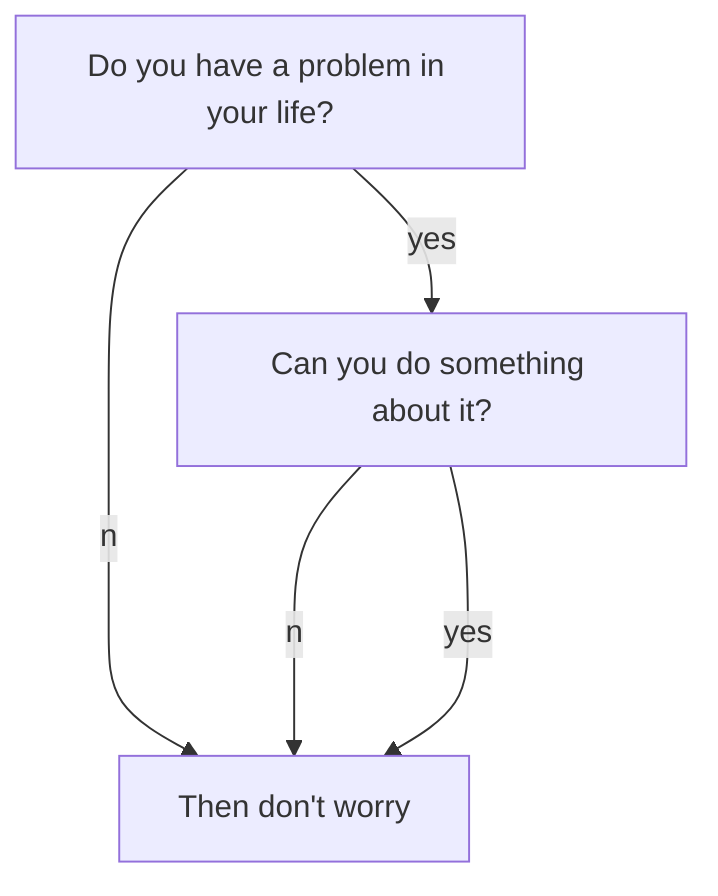
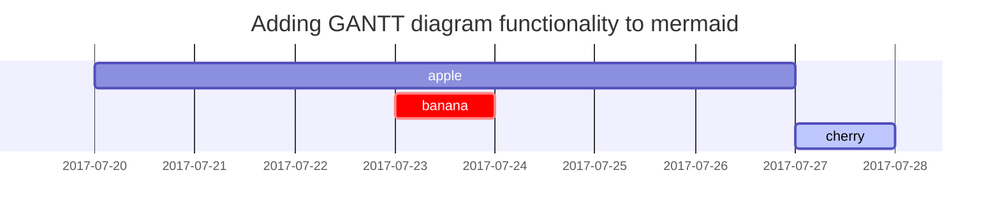

# Jekyll博客的编写

在[目录结构](http://jekyllcn.com/docs/structure/)介绍中说明过，**所有的文章都在 */_posts* 文件夹中**。这些文件可以用 Markdown 或 HTML 编写。只要文件中有 YAML 头信息，它们就会从源格式转化成 HTML 页面，从而成为你的静态网站的一部分。

<!--more-->

## 创建文章

发表一篇新文章，你所需要做的就是在 */_posts* 文件夹中创建一个新的文件。文件名的命名非常重要。Jekyll 要求一篇文章的文件名遵循下面的格式：

    年-月-日-标题.MARKUP

下面是一些合法的文件名的例子：

    2011-12-31-new-years-eve-is-awesome.md
    2012-09-12-how-to-write-a-blog.markdown

## 内容相关

所有博客文章顶部必须有一段 YAML 头信息(YAML front-matter)。

为了提高文章的阅读和书写体验，TeXt 在 Markdown 原有的基础上做了一些增强。

### YAML 头信息

```yaml
    ---
    layout: article
    title: Document - Writing Posts
    mathjax: true
    ---
```

{
在 `---` 之间你可以设置属性的值，可以把它们看作页面的配置，这些配置会覆盖在 *_config.yml* 文件中设置的全局配置。

除去 Jekyll 自定义的变量外，TeXt 也定义了一些额外的变量，详情请戳[布局](https://tianqi.name/jekyll-TeXt-theme/docs/zh/layouts)。

# Markdown增强

你需要在 *_config.yml* 或 YAML 头信息中设置相关的属性为 `true` 来开启对应的功能。

| 增强项            | 描述                                                               |
| ----------------- | ------------------------------------------------------------------ |
| **Mathjax** | 在文章中方便的加入数学公式，使用 MathML、LaTeX 和 ASCIIMathML 语法 |
| **Mermaid** | 在文章中方便的加入流程图                                           |
| **Chart**   | 在文章中方便的加入可交互的图表                                     |

## Mathjax

When 

$$
a \ne 0
$$

, there are two solutions to 
$$
ax^2 + bx + c = 0
$$

 and they are

$$
x_1 = {-b + \sqrt{b^2-4ac} \over 2a}
$$

$$
x_2 = {-b - \sqrt{b^2-4ac} \over 2a} \notag
$$

**markdown:**

```tex
When $$a \ne 0$$, there are two solutions to $$ax^2 + bx + c = 0$$ and they are
$$x_1 = {-b + \sqrt{b^2-4ac} \over 2a}$$
$$x_2 = {-b - \sqrt{b^2-4ac} \over 2a} \notag$$
```

**当 MathJax 激活后**，你可以设置 `mathjax_autoNumber: true` 让公式自动编号，你可以使用 \notag 或者 \nonumber 阻止某条公式自动编号。
{:.info}

## Mermaid



**markdown:**

    ``mermaid     graph TB;         A[Do you have a problem in your life?]         B[Then don't worry]         C[Can you do something about it?]         A--no-->B;         A--yes-->C;         C--no-->B;         C--yes-->B;     ``

[Mermaid](https://mermaidjs.github.io/) 支持以下三种示意图:

- [Flowchart](https://mermaidjs.github.io/flowchart.html)
- [Sequence Diagram](https://mermaidjs.github.io/sequenceDiagram.html)
- [Gant Diagram](https://mermaidjs.github.io/gantt.html)

## Chart

```chart
{
  "type": "line",
  "data": {
    "labels": [
      "January",
      "February",
      "March",
      "April",
      "May",
      "June",
      "July"
    ],
    "datasets": [
      {
        "label": "# of bugs",
        "fill": false,
        "lineTension": 0.1,
        "backgroundColor": "rgba(75,192,192,0.4)",
        "borderColor": "rgba(75,192,192,1)",
        "borderCapStyle": "butt",
        "borderDash": [],
        "borderDashOffset": 0,
        "borderJoinStyle": "miter",
        "pointBorderColor": "rgba(75,192,192,1)",
        "pointBackgroundColor": "#fff",
        "pointBorderWidth": 1,
        "pointHoverRadius": 5,
        "pointHoverBackgroundColor": "rgba(75,192,192,1)",
        "pointHoverBorderColor": "rgba(220,220,220,1)",
        "pointHoverBorderWidth": 2,
        "pointRadius": 1,
        "pointHitRadius": 10,
        "data": [
          65,
          59,
          80,
          81,
          56,
          55,
          40
        ],
        "spanGaps": false
      }
    ]
  },
  "options": {}
}
```

**markdown:**

    \`\`\`chart
    {
      "type": "polarArea",
      "data": {
        "datasets": [
          {
            "data": [
              11,
              16,
              7,
              3,
              14
            ],
            "backgroundColor": [
              "#FF6384",
              "#4BC0C0",
              "#FFCE56",
              "#E7E9ED",
              "#36A2EB"
            ],
            "label": "My dataset"
          }
        ],
        "labels": [
          "Red",
          "Green",
          "Yellow",
          "Grey",
          "Blue"
        ]
      },
      "options": {}
    }
    \`\`\`

[Chart.js](http://www.chartjs.org/docs/latest/) 支持以下 7 种图表:

- [Line Chart](http://www.chartjs.org/docs/latest/charts/line.html)
- [Bar Chart](http://www.chartjs.org/docs/latest/charts/bar.html)
- [Radar Chart](http://www.chartjs.org/docs/latest/charts/radar.html)
- [Polar Area Chart](http://www.chartjs.org/latest/charts/polar.html)
- [Pie Chart](http://www.chartjs.org/docs/latest/charts/doughnut.html)
- [Doughnut Chart](http://www.chartjs.org/docs/latest/charts/doughnut.html)
- [Bubble Chart](http://www.chartjs.org/docs/latest/charts/bubble.html)

# Markdown文本样式

为了展示Markdown语法的渲染，[**Chirpy**](https://github.com/cotes2020/jekyll-theme-chirpy/fork), 你也可以用它作为写作的例子。 现在，让我们来看看文本和版式。

## 标题

<h1 data-toc-skip> H1 - 开头</h1>

<h2 data-toc-skip>H2 - heading</h2>

<h3 data-toc-skip>H3 - heading</h3>

<h4>H4 - heading</h4>
**markdown:**
```markdown
# H1 - 开头

## H2 - heading

### H3 - heading

#### H4 - heading

```
<br>

## 文章段落

I wandered lonely as a cloud

That floats on high o'er vales and hills,

When all at once I saw a crowd,

A host, of golden daffodils;

Beside the lake, beneath the trees,

Fluttering and dancing in the breeze.


## 列表

### 有序列表

1. Firstly
2. Secondly
3. Thirdly

**markdown:**
```markdown
1. Firstly
2. Secondly
3. Thirdly
```

### 无序列表

- 章节
  - 节选
    - 段落

**markdown:**

```markdown
- 章节
  - 节选
    - 段落
```

### 任务列表

- [ ] TODO
- [X] Completed
- [ ] Defeat COVID-19
  - [X] Vaccine production
  - [ ] Economic recovery
  - [ ] People smile again

**markdown:**

```markdown
- [ ] TODO
- [x] Completed
- [ ] Defeat COVID-19
  - [x] Vaccine production
  - [ ] Economic recovery
  - [ ] People smile again
```

### 描述列表

Sun
: the star around which the earth orbits

Moon
: the natural satellite of the earth, visible by reflected light from the sun

**markdown:**

```markdown
Sun
: the star around which the earth orbits

Moon
: the natural satellite of the earth, visible by reflected light from the sun
```

## 引用

> This line shows the _block quote_.

**markdown:**

```markdown
> This line shows the _block quote_.
```

## 表格

| Company                      | Contact          | Country |
| :--------------------------- | :--------------- | ------: |
| Alfreds Futterkiste          | Maria Anders     | Germany |
| Island Trading               | Helen Bennett    |      UK |
| Magazzini Alimentari Riuniti | Giovanni Rovelli |   Italy |

**markdown:**

```markdown
| Company                      | Contact          | Country |
|:-----------------------------|:-----------------|--------:|
| Alfreds Futterkiste          | Maria Anders     | Germany |
| Island Trading               | Helen Bennett    | UK      |
| Magazzini Alimentari Riuniti | Giovanni Rovelli | Italy   |
```

## 链接

[http://127.0.0.1:4000](http://127.0.0.1:4000)

**markdown:**

```markdown
<http://127.0.0.1:4000>
```

## 脚注

点击右上边的脚注[^footnote], 这里是另一个脚注[^fn-nth-2].

**markdown:**

```markdown
点击右上边的脚注[^footnote], 这里是另一个脚注[^fn-nth-2].
```

### 脚注注释

[^footnote]: The footnote source
    
[^fn-nth-2]: The 2nd footnote source
    
**markdown:**

```markdown
[^footnote]: The footnote source
[^fn-nth-2]: The 2nd footnote source
```

## 提示

| 样式名称          |
| ----------------- |
| **success** |
| **info**    |
| **warning** |
| **error**   |

Success Text.
{:.success}

Info Text.
{:.info}

Warning Text.
{:.warning}

Error Text.
{:.error}

**markdown:**

    Success Text.
    {:.success}
^
    Info Text.
    {:.info}
^
    Warning Text.
    {:.warning}
^
    Error Text.
    {:.error}

## 标签

| Class Names       |
| ----------------- |
| **success** |
| **info**    |
| **warning** |
| **error**   |

`success`{:.success}

`info`{:.info}

`warning`{:.warning}

`error`{:.error}

**markdown:**

    `success`{:.success}
^
    `info`{:.info}
^
    `warning`{:.warning}
^
    `error`{:.error}

## 图像

| 样式名称          |
| ----------------- |
| **border**  |
| **shadow**  |
| **rounded** |
| **circle**  |

### Border

<div class="grid-containre">
<div class="grid grid--p-2">
<div class="cell cell--12 cell--md-4 " markdown="1">
{:.border}
</div>
<div class="cell cell--12 cell--md-auto" markdown="1">
    {:.border}
</div>
</div>
</div>

### Shadow

<div class="grid-containre">
<div class="grid grid--p-2">
<div class="cell cell--12 cell--md-4 " markdown="1">
{:.shadow}
</div>
<div class="cell cell--12 cell--md-auto" markdown="1">
    {:.shadow}
</div>
</div>
</div>

### Rounded

<div class="grid-containre">
<div class="grid grid--p-2">
<div class="cell cell--12 cell--md-4 " markdown="1">
{:.rounded}
</div>
<div class="cell cell--12 cell--md-auto" markdown="1">
    {:.rounded}
</div>
</div>
</div>

### Circle

<div class="grid-containre">
<div class="grid grid--p-2">
<div class="cell cell--12 cell--md-4 " markdown="1">
{:.circle}
</div>
<div class="cell cell--12 cell--md-auto" markdown="1">
    {:.circle}
</div>
</div>
</div>

### Mixture

<div class="grid-containre">
<div class="grid grid--p-2">
<div class="cell cell--12 cell--md-4 " markdown="1">
{:.border.rounded}
</div>
<div class="cell cell--12 cell--md-auto" markdown="1">
    {:.border.rounded}
</div>
</div>
</div>

<div class="grid-containre">
<div class="grid grid--p-2">
<div class="cell cell--12 cell--md-4 " markdown="1">
{:.circle.shadow}
</div>
<div class="cell cell--12 cell--md-auto" markdown="1">
    {:.circle.shadow}
</div>
</div>
</div>

<div class="grid-containre">
<div class="grid grid--p-2">
<div class="cell cell--12 cell--md-4 " markdown="1">
{:.circle.border.shadow}
</div>
<div class="cell cell--12 cell--md-auto" markdown="1">
    {:.circle.border.shadow}
</div>
</div>
</div>

- 默认 (带说明文字)

{: width="20%" height="20%"}
_Full screen width and center alignment_

<br>

- 阴影

{: .shadow width="20%" height="20%" style="max-width: 90%" }
_shadow effect (visible in light mode)_

<br>

- 左对齐

{: width="20%" height="20%" style="max-width: 70%" .normal}

<br>

- 向左浮动

  {: width="20%" height="20%" style="max-width: 200px" .left}
  "一个重复和无意义的文本被用来填补空白。 一个重复和无意义的文本被用来填补空白。 一个重复和无意义的文本被用来填补空白。 一个重复和无意义的文本被用来填补空白。 一个重复和无意义的文本被用来填补空白。 一个重复和无意义的文本被用来填补空白。 一个重复和无意义的文本被用来填补空白。 一个重复和无意义的文本被用来填补空白。 一个重复和无意义的文本被用来填补空白。 一个重复和无意义的文本被用来填补空白。 一个重复和无意义的文本被用来填补空白。 一个重复和无意义的文本被用来填补空白。  "

<br>

- 向右浮动

  {: width="20%" height="20%" style="max-width: 200px" .right}
  "一个重复和无意义的文本被用来填补空白。 一个重复和无意义的文本被用来填补空白。 一个重复和无意义的文本被用来填补空白。 一个重复和无意义的文本被用来填补空白。 一个重复和无意义的文本被用来填补空白。 一个重复和无意义的文本被用来填补空白。 一个重复和无意义的文本被用来填补空白。 一个重复和无意义的文本被用来填补空白。 一个重复和无意义的文本被用来填补空白。 一个重复和无意义的文本被用来填补空白。 一个重复和无意义的文本被用来填补空白。 一个重复和无意义的文本被用来填补空白。  "

<br>

## Mermaid SVG



**markdown:**

```
\`\`\`mermaid
 gantt
  title  Adding GANTT diagram functionality to mermaid
  apple :a, 2017-07-20, 1w
  banana :crit, b, 2017-07-23, 1d
  cherry :active, c, after b a, 1d
\`\`\`
```

## Mathematics

The mathematics powered by [**MathJax**](https://www.mathjax.org/):

$$
\sum_{n=1}^\infty 1/n^2 = \frac{\pi^2}{6}
$$

When $a \ne 0$, there are two solutions to $ax^2 + bx + c = 0$ and they are

$$
x = {-b \pm \sqrt{b^2-4ac} \over 2a}
$$

```markdown
The mathematics powered by [**MathJax**](https://www.mathjax.org/):

$$ \sum_{n=1}^\infty 1/n^2 = \frac{\pi^2}{6} $$

When $a \ne 0$, there are two solutions to $ax^2 + bx + c = 0$ and they are

$$ x = {-b \pm \sqrt{b^2-4ac} \over 2a} $$
```

## 内联代码

这是一个例子 `Inline Code`.

**Markdown:**

```markdown
这是一个例子 `Inline Code`.
```

## 文件路径

这儿是 `/path/to/the/file.extend`{: .filepath}.
**Markdown:**

```markdown
这儿是 `/path/to/the/file.extend`{: .filepath}.
```

## 代码块

### 普通

```
这是一个普通的代码片段，没有语法突出显示和行号。  
```

### 特定语言

#### Console

```console
$ env |grep SHELL
SHELL=/usr/local/bin/bash
PYENV_SHELL=bash
```

#### Shell

```bash
if [ $? -ne 0 ]; then
    echo "The command was not successful.";
    #do the needful / exit
fi;
```

### Specific filename

语法sass

```sass
@import
  "colors/light-typography",
  "colors/dark-typography"
```


<p>TeXt 使用  <span></span> 作为它的 Logo，你可以通过替换 <em>_includes/svg/logo.svg</em> 来设置你的 Logo。</p>


[^ALDs]: 
|  |  |
| - | - |
|  |  |
|  |  |


|  |  |
| - | - |
|  |  |
|  |  |
|  |  |


|  |  |
| - | - |
|  |  |


|  |  |
| - | - |
|  |  |


<!-- more -->


<!-- @start locale config -->

|  |  |
| - | - |
|  |  |
|  |  |
|  |  |
|  |  |
|  |  |

<!-- @end locale config -->


|  |  |  |  |
| - | - | - | - |
|  |  |  |  |
|  |  |  |  |
|  |  |  |  |
|  |  |  |  |
|  |  |  |  |
|  |  |  |  |
|  |  |  |  |
|  |  |  |  |
|  |  |  |  |
|  |  |  |  |
|  |  |  |  |
|  |  |  |  |
|  |  |  |  |
|  |  |  |  |
|  |  |  |  |
|  |  |  |  |
|  |  |  |  |
|  |  |  |  |
|  |  |  |  |
|  |  |  |  |
|  |  |  |  |
|  |  |  |  |
|  |  |  |  |

|  |  |  |
| - | - | - |
|  |  |  |
|  |  |  |

|  |  |  |
| - | - | - |
|  |  |  |
|  |  |  |
|  |  |  |
|  |  |  |
|  |  |  |
|  |  |  |
|  |  |  |

|  |  |  |
| - | - | - |
|  |  |  |
|  |  |  |

|  |  |  |
| - | - | - |
|  |  |  |

|  |  |  |
| - | - | - |
|  |  |  |

|  |  |  |
| - | - | - |
|  |  |  |


|  |  |  |  |
| - | - | - | - |
|  |  |  |  |
|  |  |  |  |
|  |  |  |  |
|  |  |  |  |
|  |  |  |  |


|  |  |  |
| - | - | - |
|  |  |  |

|  |  |  |
| - | - | - |
|  |  |  |
|  |  |  |
|  |  |  |
|  |  |  |
|  |  |  |
|  |  |  |
|  |  |  |
|  |  |  |
|  |  |  |
|  |  |  |


|  |  |
| - | - |
|  |  |
|  |  |


|  |  |  |
| - | - | - |
|  |  |  |


<!--more-->
